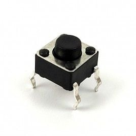

# Introduction to Arduino

<!-- <figure>
  
  <figcaption>Example of Arduino Uno</figcaption>
</figure> -->

{ loading=lazy width=300 align=left }

The first Arduino board was introduced in 2005 to help design students — who had no previous experience in electronics or microcontroller programming — to create working prototypes connecting the physical world to the digital world. Since then it has become the most popular electronics prototyping tool used by engineers and even large corporations.[^1]

## What is Arduino?

> Arduino is the go-to gear for artists, hobbyists, students, and anyone with a gadgetry dream.

## SIK Components

| Name | Image | Type of Input | Function |
| :--: | :--: | :--: | :--: |
| Push Button |{ loading=lazy width=100 }| Digital|Close or open circuit|
| Tactile Switch ||||

## Electronics Basic Concept

### Ohm's Law

Ohm's law describes the relationship between Voltage ($V$), Current ($I$), and Resistance ($R$). The general equation is:

$$
V=IR
$$

* **Voltage, $V$** is defined as the amount of potential energy in a circuit. (Unit: Volts (V))
* **Current, $I$** is 

[^1]: https://www.arduino.cc/en/Main/AboutUs